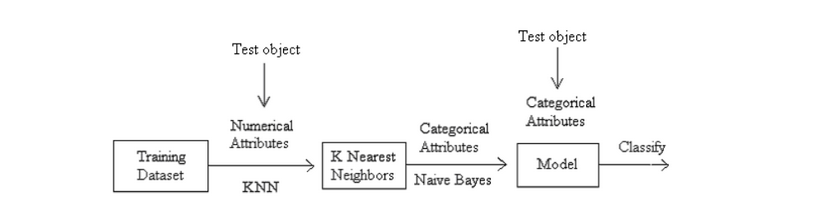

# Music Recommendation Engine

- A recommendation engine built using Google's Cloud Functions and Typescript

- cNK (combination between Naive Bayes and K-NN) algorithm was used

- Heavily inspired by this <a href="https://www.researchgate.net/publication/289846895_Combination_of_Naive_Bayes_Classifier_and_K-Nearest_Neighbor_cNK_in_the_Classification_Based_Predictive_Models">technical paper</a>

## Explanation

In this project, a recommendation engine is built from scratch by the aid of the Spotify dataset which includes thousands of song records with their respective features. In brief, the attributes for each song are initially normalized using feature scaling techniques, which is then used to feed the KNN and Naïve Bayes (cKN) classifiers to recommend the most suitable songs.

